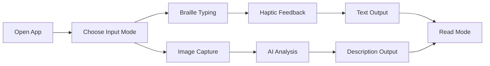

# 🌟 TouchVision
### *Bridging Worlds Through Touch and Intelligence*

*Breaking barriers, building connections, transforming lives*

---

## 🌟 About This Project

This groundbreaking **assistive technology solution** is specifically designed for individuals who are both blind and deaf, empowering them to communicate and understand their surroundings through an intuitive, inclusive interface. Built with cutting-edge AI technology and thoughtful accessibility design, this app transforms how users interact with the world around them.

> *"Technology should be a bridge, not a barrier. This app creates connections where none existed before."*

## ✨ Key Features

### 🔤 **Revolutionary Braille Input System**

- **6-Dot Virtual Braille Pad**: Tactile 3×2 button layout following standard Braille conventions
- **Intuitive Navigation**: "Next Letter" and "Next Word" buttons for seamless text composition  
- **Real-Time Text Display**: Live workspace showing typed content as it's created
- **Error Correction**: Built-in backspace and editing capabilities

### 📳 **Advanced Haptic Feedback System**
- **Distinct Vibration Patterns**: Unique feedback for every action and input
- **Confirmation Cues**: Immediate tactile response for successful operations
- **Pattern Recognition**: Consistent vibration language throughout the app
- **Customizable Intensity**: Adjustable feedback strength for user comfort

### 🔄 **Intelligent Mode Switching**
<table>
<tr>
<td width="50%">

**📊 Number Mode**
- Switch seamlessly to numerical input
- Braille number combinations
- Mathematical operations support
- Calculator-like functionality

</td>
<td width="50%">

**📖 Read Mode**
- Output narration activation
- Text-to-haptic conversion
- Reading confirmation feedback
- Voice synthesis integration

</td>
</tr>
</table>

### 🌍 **AI-Powered Environmental Awareness**
- **OpenAI Vision Integration**: Advanced image analysis and interpretation
- **Contextual Scene Description**: Detailed narration of surroundings
- **People & Emotion Detection**: Facial expression and mood recognition
- **Object & Location Identification**: Comprehensive environmental mapping
- **Real-Time Processing**: Instant image-to-description conversion

## 💡 How It Works

### Step-by-Step User Journey

1. **🎯 Input Selection**: User chooses between text input or environmental scanning
2. **⌨️ Braille Composition**: Six-dot system allows natural Braille typing with vibration confirmation
3. **📸 Image Capture**: One-touch photography for environmental analysis
4. **🤖 AI Processing**: OpenAI Vision API analyzes and interprets visual data
5. **📳 Haptic Output**: Results delivered through personalized vibration patterns
6. **🔄 Continuous Interaction**: Seamless flow between input and output modes

## 🎯 Real-World Impact

### 🌟 **Transforming Daily Life**

<table>
<tr>
<td width="33%" align="center">

### 🏠 **At Home**
Navigate familiar spaces with confidence, identify objects, and understand household environments through detailed AI descriptions.

</td>
<td width="33%" align="center">

### 🌆 **In Public**
Understand crowded spaces, identify people's emotions, read signs and text, and navigate complex environments independently.

</td>
<td width="33%" align="center">

### 💼 **At Work**
Professional communication, document interaction, and workplace navigation become accessible and efficient.

</td>
</tr>
</table>

## 🛠️ Technical Architecture

| Component | Technology | Purpose |
|-----------|------------|---------|
| **Frontend** | React Native | Cross-platform mobile interface |
| **Language** | JavaScript | Core application logic |
| **AI Vision** | OpenAI Vision API | Image analysis and interpretation |
| **Haptics** | React Native Haptic Feedback | Tactile user interaction |
| **Accessibility** | React Native Accessibility | Screen reader compatibility |
| **Camera** | React Native Camera | Image capture functionality |

## 🌈 Use Case Scenario

**Meet Sarah**: *A professional who is both blind and deaf*

1. **🌅 Morning Routine**: Sarah opens the app and uses the Braille input to compose a message to her colleague
2. **🚌 Commute**: She captures an image of the bus stop to understand crowd levels and bus arrival information
3. **🏢 At Work**: Using image capture, she identifies people in meeting rooms and reads their facial expressions
4. **🛒 Shopping**: She scans product labels and receives detailed descriptions of items and prices
5. **🏠 Evening**: She captures family photos to understand emotions and interactions happening around her

*Every interaction is confirmed through personalized haptic feedback, creating a seamless communication bridge with her environment.*

## 🎨 Accessibility Features

- **WCAG 2.1 AAA Compliance**: Exceeds accessibility standards
- **High Contrast Mode**: Enhanced visual elements for partial sight users  
- **Customizable Haptics**: Personalized vibration patterns and intensity
- **Voice Over Compatible**: Full screen reader integration
- **Large Touch Targets**: Optimized button sizes for easy interaction
- **Gesture Navigation**: Intuitive swipe and tap controls

## 🗺️ Roadmap

- [x] **Phase 1**: Core Braille input and haptic feedback
- [x] **Phase 2**: OpenAI Vision integration for environmental awareness  
- [ ] **Phase 3**: Multi-language Braille support
- [ ] **Phase 4**: Offline AI capabilities for remote areas
- [ ] **Phase 5**: Smart home device integration
- [ ] **Phase 6**: Community features and user-to-user communication

### 🌟 Star us on GitHub — every star helps spread awareness!

**Made with 🤝 compassion and dedication to accessibility**

*Building bridges, breaking barriers, transforming lives through technology.*

